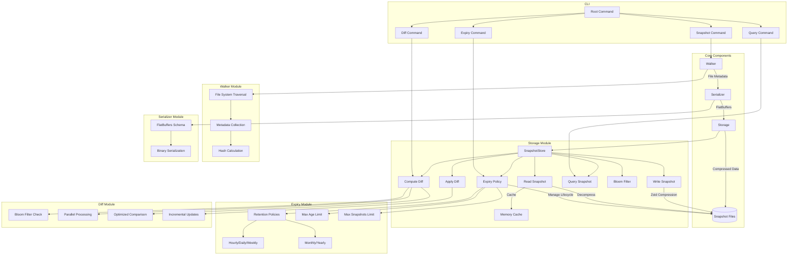

# FlashFS: High-Performance File System Snapshot Tool

FlashFS is a high-performance file system snapshot and comparison tool designed for large-scale environments. It efficiently captures file system metadata, stores it in a compact format, and provides fast comparison capabilities.

## Features

- **Blazing Fast Snapshots**: Efficiently captures file system metadata with minimal overhead
- **Incremental Snapshots**: Stores only changes between snapshots to minimize storage requirements
- **Efficient Storage**: Uses FlatBuffers for compact binary representation and Zstd compression
- **In-Memory Caching**: Implements LRU caching for frequently accessed snapshots
- **Bloom Filters**: Quickly identifies modified files without full snapshot comparison
- **Enhanced Diff Generation**: Creates, stores, and applies optimized diffs between snapshots with parallel processing
- **Snapshot Expiry Policies**: Automatically manages snapshot lifecycle with configurable retention policies

## Architecture



## Installation

```bash
go install github.com/TFMV/flashfs@latest
```

Or build from source:

```bash
git clone https://github.com/TFMV/flashfs.git
cd flashfs
go build -o flashfs
```

## Usage

### Taking a Snapshot

```bash
flashfs snapshot --path /path/to/directory --output snapshot.snap
```

### Comparing Snapshots

```bash
flashfs diff --base snapshot1.snap --target snapshot2.snap --output diff.diff
```

For detailed comparison with additional options:

```bash
flashfs diff --base snapshot1.snap --target snapshot2.snap --output diff.diff --detailed --parallel 4
```

### Applying a Diff

```bash
flashfs apply --base snapshot1.snap --diff diff.diff --output snapshot2.snap
```

### Querying a Snapshot

```bash
flashfs query --snapshot snapshot.snap --path "/some/path/*" --modified-after "2023-01-01"
```

### Managing Snapshot Expiry Policies

Set a retention policy to keep a specific number of snapshots:

```bash
flashfs expiry set --max-snapshots 10
```

Set an age-based expiry policy:

```bash
flashfs expiry set --max-age 30d
```

Configure a granular retention policy:

```bash
flashfs expiry set --keep-hourly 24 --keep-daily 7 --keep-weekly 4 --keep-monthly 12
```

Apply the current expiry policy to clean up old snapshots:

```bash
flashfs expiry apply
```

Show the current expiry policy:

```bash
flashfs expiry show
```

## Performance Considerations

FlashFS is designed for high performance:

- Uses efficient file system traversal with `godirwalk`
- Implements BLAKE3 hashing for fast content verification
- Employs FlatBuffers for zero-copy deserialization
- Uses Zstd compression for optimal size/speed balance
- Implements in-memory caching for frequently accessed snapshots
- Uses Bloom filters to quickly identify changed files

## Snapshot Lifecycle Management

FlashFS provides flexible snapshot lifecycle management through expiry policies:

- **Maximum Snapshots**: Limit the total number of snapshots to keep
- **Maximum Age**: Automatically remove snapshots older than a specified duration
- **Retention Policies**: Configure granular retention for different time periods:
  - Hourly: Keep a specified number of hourly snapshots
  - Daily: Keep a specified number of daily snapshots
  - Weekly: Keep a specified number of weekly snapshots
  - Monthly: Keep a specified number of monthly snapshots
  - Yearly: Keep a specified number of yearly snapshots

Expiry policies are applied automatically when new snapshots are created, or can be manually applied using the `expiry apply` command.

## Enhanced Diff Computation

FlashFS implements advanced diff computation techniques to efficiently identify and represent changes between snapshots:

- **Bloom Filter Pre-check**: Uses Bloom filters to quickly identify potentially modified files before performing detailed comparisons
- **Parallel Processing**: Distributes diff computation across multiple CPU cores for faster processing of large snapshots
- **Optimized Comparison**: Compares only necessary file attributes (path, size, modification time, permissions, hash) to minimize processing overhead
- **Incremental Updates**: Generates compact diff files that contain only the changes between snapshots
- **Detailed Comparison Options**: Provides options for controlling the level of detail in diff operations:
  - Hash-based comparison for detecting content changes even when metadata is unchanged
  - Path-based filtering to focus diff operations on specific directories
  - Configurable parallelism for optimizing performance based on available resources

The diff system enables efficient storage and transfer of incremental changes, making it ideal for backup systems, file synchronization, and monitoring file system changes over time.

## Dependencies

- [FlatBuffers](https://github.com/google/flatbuffers) - Efficient serialization
- [Zstd](https://github.com/klauspost/compress) - Fast compression
- [BLAKE3](https://github.com/zeebo/blake3) - High-performance hashing
- [godirwalk](https://github.com/karrick/godirwalk) - Fast directory traversal

## Contributing

Contributions are welcome! Please feel free to submit a Pull Request.

## License

This project is licensed under the MIT License - see the [LICENSE](LICENSE) file for details.
