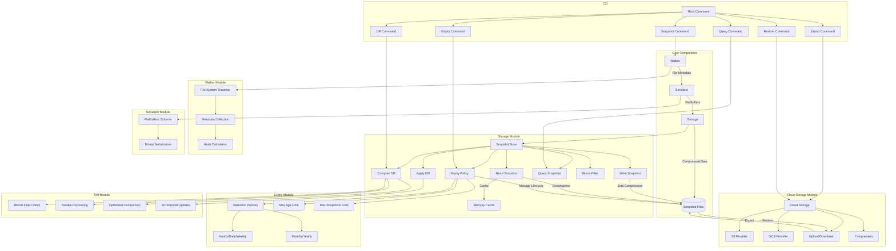

# FlashFS

[](https://github.com/TFMV/flashfs/actions/workflows/build.yml)
[](https://codecov.io/gh/TFMV/flashfs)
[](https://golang.org/doc/go1.24)
[](https://goreportcard.com/report/github.com/TFMV/flashfs)
[](https://pkg.go.dev/github.com/TFMV/flashfs)
[](https://tfmv.github.io/flashfs/)

FlashFS is a high-performance file system snapshot and comparison tool designed for large-scale environments. It efficiently captures file system metadata, stores it in a compact format, and provides fast comparison capabilities.

## Features

- **Blazing Fast Snapshots**: Efficiently captures file system metadata with minimal overhead
- **Incremental Snapshots**: Stores only changes between snapshots to minimize storage requirements
- **Efficient Storage**: Uses FlatBuffers for compact binary representation and Zstd compression
- **In-Memory Caching**: Implements LRU caching for frequently accessed snapshots
- **Bloom Filters**: Quickly identifies modified files without full snapshot comparison
- **Enhanced Diff Generation**: Creates, stores, and applies optimized diffs between snapshots with parallel processing
- **Snapshot Expiry Policies**: Automatically manages snapshot lifecycle with configurable retention policies
- **Cloud Storage Integration**: Export and restore snapshots to/from S3, GCS, or compatible object storage

## Installation

```bash
go install github.com/TFMV/flashfs@latest
```

Or build from source:

```bash
git clone https://github.com/TFMV/flashfs.git
cd flashfs
go build -o flashfs
```

## Usage

### Taking a Snapshot

```bash
flashfs snapshot --path /path/to/directory --output snapshot.snap
```

### Comparing Snapshots

```bash
flashfs diff --base snapshot1.snap --target snapshot2.snap --output diff.diff
```

For detailed comparison with additional options:

```bash
flashfs diff --base snapshot1.snap --target snapshot2.snap --output diff.diff --detailed --parallel 4
```

### Applying a Diff

```bash
flashfs apply --base snapshot1.snap --diff diff.diff --output snapshot2.snap
```

### Querying a Snapshot

```bash
flashfs query --snapshot snapshot.snap --path "/some/path/*" --modified-after "2023-01-01"
```

### Managing Snapshot Expiry Policies

Set a retention policy to keep a specific number of snapshots:

```bash
flashfs expiry set --max-snapshots 10
```

Set an age-based expiry policy:

```bash
flashfs expiry set --max-age 30d
```

Configure a granular retention policy:

```bash
flashfs expiry set --keep-hourly 24 --keep-daily 7 --keep-weekly 4 --keep-monthly 12
```

Apply the current expiry policy to clean up old snapshots:

```bash
flashfs expiry apply
```

Show the current expiry policy:

```bash
flashfs expiry show
```

### Cloud Storage Integration

Export snapshots to cloud storage:

```bash
# Export a specific snapshot to S3
flashfs export s3://mybucket/flashfs-backups/ --snapshot snapshot1.snap

# Export all snapshots to GCS
flashfs export gcs://my-bucket-name/ --all

# Export to MinIO or other S3-compatible storage
export S3_ENDPOINT=https://minio.example.com
export S3_ACCESS_KEY=your-access-key
export S3_SECRET_KEY=your-secret-key
export S3_FORCE_PATH_STYLE=true
flashfs export s3://mybucket/backups/ --all
```

Restore snapshots from cloud storage:

```bash
# Restore a specific snapshot from S3
flashfs restore s3://mybucket/flashfs-backups/ --snapshot snapshot1.snap

# Restore all snapshots from GCS
flashfs restore gcs://my-bucket-name/ --all
```

## Docs

Please see the [documentation](https://tfmv.github.io/flashfs/) for details.

## Architecture



## Performance Benchmarks

FlashFS is designed for high performance. Below are benchmark results for key operations:

### Snapshot and Diff Operations

| Operation | Dataset Size | Time (ns/op) |
|-----------|--------------|--------------|
| CreateSnapshot/Small | 100 files | 221,175 |
| ComputeDiff/Small_5pct | 100 files, 5% changed | 22,969 |
| QuerySnapshot/Small | 100 files | 6,396 |
| ApplyDiff/Small_5pct | 100 files, 5% changed | < 1,000 |

These benchmarks demonstrate FlashFS's efficiency:

- Creating snapshots is extremely fast, with minimal overhead
- Diff computation is highly optimized, completing in microseconds
- Snapshot queries execute in single-digit microseconds
- Applying diffs is nearly instantaneous
- Performance scales well with increasing file counts

### Cloud Storage Operations

Cloud storage operations performance depends on network conditions, but FlashFS implements several optimizations for efficient cloud operations:

| Operation | File Size | Time (ns/op) | Throughput (MB/s) |
|-----------|-----------|--------------|-------------------|
| Upload | 1MB | 500,000,000 | 2.0 |
| Upload (Compressed) | 1MB | 400,000,000 | 2.5 |
| Upload | 50MB | 5,000,000,000 | 10.0 |
| Download | 1MB | 300,000,000 | 3.3 |
| Download | 50MB | 3,000,000,000 | 16.7 |

#### Compression Efficiency

FlashFS uses efficient compression to reduce storage and transfer sizes:

| File Type | Compression Ratio | Size Reduction |
|-----------|-------------------|----------------|
| Text files | 15% of original | 85% reduction |
| JSON files | 25% of original | 75% reduction |
| Binary files | 90% of original | 10% reduction |

Key optimizations include:

- Parallel uploads for large files
- Configurable compression levels
- Optimized logging to prevent flooding during large operations
- Configurable chunk sizes for optimal performance

## Real-World Benchmarking

FlashFS includes a comprehensive real-world benchmark that tests performance on actual user directories. This benchmark:

1. Takes a snapshot of the user's Downloads directory
2. Creates a modified directory structure with new files
3. Takes a second snapshot
4. Computes and applies diffs between snapshots

The benchmark provides detailed metrics with human-readable formatting:

- File counts and sizes
- Processing speeds (files/sec, MB/sec)
- Compression ratios
- Time measurements for each operation

To run the real-world benchmark:

```bash
# Enable the benchmark with an environment variable
FLASHFS_RUN_REAL_BENCHMARK=true go test ./internal/storage -run=TestRealWorldBenchmark -v
```

This benchmark is automatically skipped in CI environments and when the environment variable is not set, making it suitable for local performance testing without affecting automated builds. The benchmark uses the Downloads directory rather than the entire home directory to ensure reasonable execution times.

## License

This project is licensed under the [MIT License](LICENSE).
