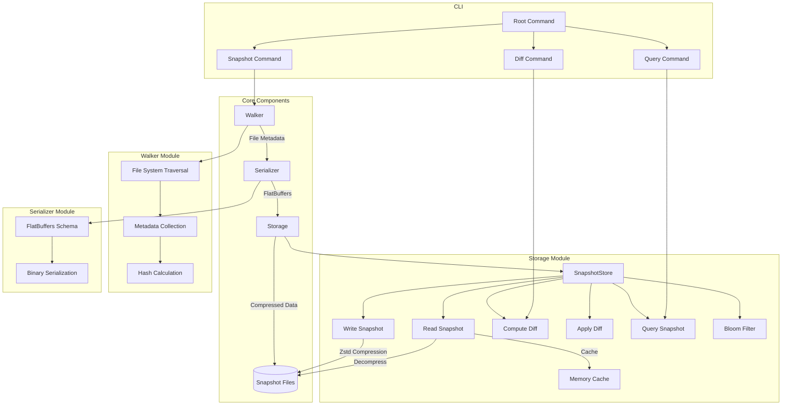

# FlashFS: High-Performance File System Snapshot Tool

FlashFS is a high-performance file system snapshot and comparison tool designed for large-scale environments. It efficiently captures file system metadata, stores it in a compact format, and provides fast comparison capabilities.

## Features

- **Blazing Fast Snapshots**: Efficiently captures file system metadata with minimal overhead
- **Incremental Snapshots**: Stores only changes between snapshots to minimize storage requirements
- **Efficient Storage**: Uses FlatBuffers for compact binary representation and Zstd compression
- **In-Memory Caching**: Implements LRU caching for frequently accessed snapshots
- **Bloom Filters**: Quickly identifies modified files without full snapshot comparison
- **Diff Generation**: Creates and applies diffs between snapshots

## Architecture



## Installation

```bash
go install github.com/TFMV/flashfs@latest
```

Or build from source:

```bash
git clone https://github.com/TFMV/flashfs.git
cd flashfs
go build -o flashfs
```

## Usage

### Taking a Snapshot

```bash
flashfs snapshot --path /path/to/directory --output snapshot.snap
```

### Comparing Snapshots

```bash
flashfs diff --base snapshot1.snap --target snapshot2.snap --output diff.diff
```

### Applying a Diff

```bash
flashfs apply --base snapshot1.snap --diff diff.diff --output snapshot2.snap
```

### Querying a Snapshot

```bash
flashfs query --snapshot snapshot.snap --path "/some/path/*" --modified-after "2023-01-01"
```

## Performance Considerations

FlashFS is designed for high performance:

- Uses efficient file system traversal with `godirwalk`
- Implements BLAKE3 hashing for fast content verification
- Employs FlatBuffers for zero-copy deserialization
- Uses Zstd compression for optimal size/speed balance
- Implements in-memory caching for frequently accessed snapshots
- Uses Bloom filters to quickly identify changed files

## Dependencies

- [FlatBuffers](https://github.com/google/flatbuffers) - Efficient serialization
- [Zstd](https://github.com/klauspost/compress) - Fast compression
- [BLAKE3](https://github.com/zeebo/blake3) - High-performance hashing
- [godirwalk](https://github.com/karrick/godirwalk) - Fast directory traversal

## Contributing

Contributions are welcome! Please feel free to submit a Pull Request.

## License

This project is licensed under the MIT License - see the [LICENSE](LICENSE) file for details.
