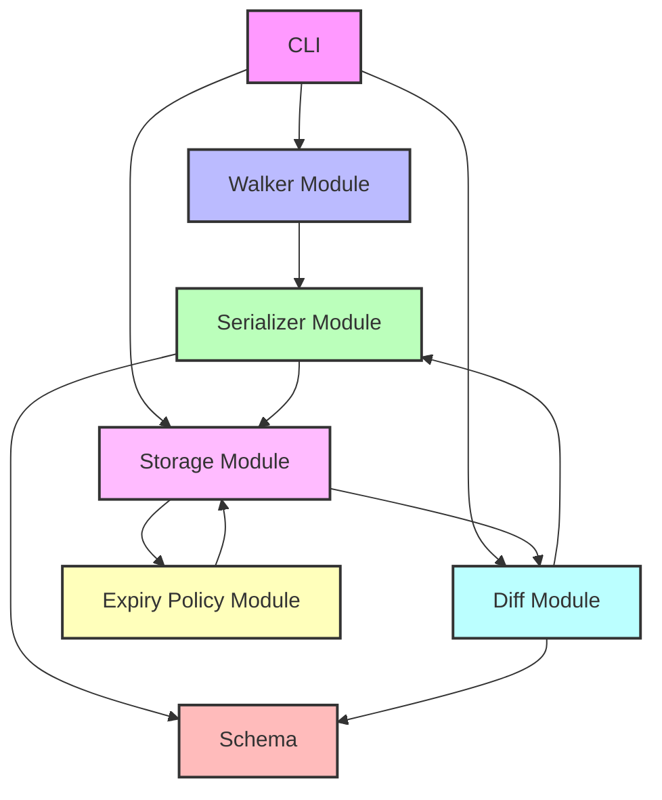

# FlashFS Documentation

FlashFS is a high-performance file system snapshot and diff tool designed for efficiently tracking and managing changes across file systems over time.

## Overview

FlashFS allows you to:

- **Create snapshots** of your file system's state at a point in time
- **Compare snapshots** to identify exactly what has changed
- **Generate and apply diffs** between snapshots for efficient incremental backups
- **Manage snapshot lifecycle** with flexible expiry policies
- **Query snapshots** to find specific files or directories

FlashFS is optimized for performance, with features like parallel processing, efficient binary serialization, content-based deduplication, and intelligent caching.

## Key Components

FlashFS consists of several modular components, each responsible for a specific aspect of the system:

| Component | Description |
|-----------|-------------|
| [CLI](cli.md) | Command-line interface for interacting with FlashFS |
| [Walker](walker.md) | Traverses file systems to collect metadata |
| [Serializer](serializer.md) | Converts metadata to efficient binary format |
| [Schema](schema.md) | Defines data structures using FlatBuffers |
| [Storage](storage.md) | Manages storage and retrieval of snapshots and diffs |
| [Diff Computation](diff-computation.md) | Computes and applies differences between snapshots |
| [Expiry Policy](expiry-policy.md) | Manages snapshot lifecycle and cleanup |

## Architecture



## Getting Started

### Installation

```bash
go install github.com/TFMV/flashfs@latest
```

### Basic Usage

Create a snapshot:

```bash
flashfs snapshot create --source /path/to/directory --output my-snapshot.snap
```

Compare two snapshots:

```bash
flashfs diff --base snapshot1.snap --target snapshot2.snap --output changes.diff
```

Apply a diff to generate a new snapshot:

```bash
flashfs apply --base snapshot1.snap --diff changes.diff --output snapshot2.snap
```

List snapshots:

```bash
flashfs snapshot list --dir /path/to/snapshots
```

### Advanced Features

FlashFS includes advanced features like:

- **Bloom filters** for rapid change detection
- **Content-based deduplication** using BLAKE3 hashing
- **Parallel processing** for faster snapshot and diff operations
- **Configurable compression** using zstd
- **Efficient caching** for frequently accessed snapshots
- **Query capabilities** for finding specific files in snapshots

## Performance

FlashFS is designed for high performance:

- **Fast snapshot creation** with parallel file system traversal
- **Efficient binary serialization** using FlatBuffers
- **Minimal memory usage** with streaming processing
- **Quick diff computation** using Bloom filters for pre-filtering
- **Optimal compression** with zstd for storage efficiency

## Use Cases

- **Backup systems**: Create incremental backups by storing only changes
- **File synchronization**: Identify differences between systems efficiently
- **Change monitoring**: Track file system changes over time
- **Deployment verification**: Ensure consistency across deployed systems
- **Data migration**: Track changes during migration processes

## Documentation

For detailed information on each component, please refer to the dedicated documentation pages linked in the [Key Components](#key-components) section above.
